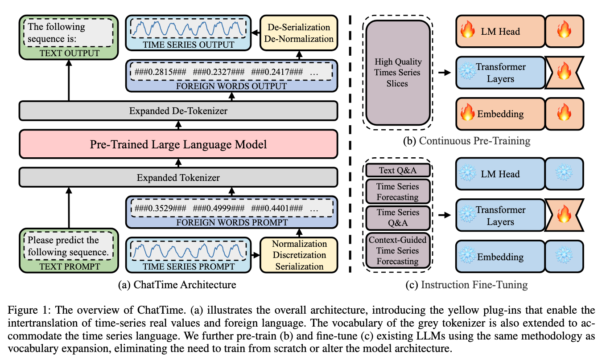

<div align="center">

# ChatTime: A Multimodal Time Series Foundation Model

[](https://arxiv.org/abs/0000.00000)
[](https://huggingface.co/collections/ChengsenWang/chattime-datasets-6731b504efecc8a6e439741c)
[](https://huggingface.co/collections/ChengsenWang/chattime-models-6731b650cb98bc7842713fde)

</div>

## ✨ Introduction

Human experts typically integrate numerical and textual multimodal information to analyze time series. However, most traditional deep learning predictors rely solely on unimodal numerical data, using a fixed-length window for training and prediction on a single dataset, and cannot adapt to different scenarios. The powered pre-trained large language model has introduced new opportunities for time series analysis. Yet, existing methods are either inefficient in training, incapable of handling textual information, or lack zero-shot forecasting capability. In this paper, we innovatively model time series as a foreign language and construct ChatTime, a unified framework for time series and text processing. As an out-of-the-box multimodal time series foundation model, ChatTime provides zero-shot forecasting capability and supports bimodal input/output for both time series and text. We design a series of experiments to verify the superior performance of ChatTime across multiple tasks and scenarios, and create four multimodal datasets to address data gaps. The experimental results demonstrate the potential and utility of ChatTime. Specifically, in the unimodal zero-shot forecasting task, ChatTime achieves 99.9% of the previous state-of-the-art using only 4% of the pre-training data. In the multimodal tasks of context-guided forecasting and time series question answering, ChatTime outperforms the previous state-of-the-art by 3.7% and 36.6%, respectively.



## 📈 Usage

## :floppy_disk: Datasets

## 📝 Citation

If you find this repo or our work useful for your research, please consider citing the paper:

```tex
@inproceedings{
  author    = {Chengsen Wang and Qi Qi and Jingyu Wang and Haifeng Sun and Zirui Zhuang and Jinming Wu and Lei Zhang and Jianxin Liao},
  title     = {ChatTime: A Unified Multimodal Time Series Foundation Model Bridging Numerical and Textual Data},
  booktitle = {},
  year      = {2024},
}
```

## 📪 Contact

If you have any question, please contact [cswang@bupt.edu.cn](cswang@bupt.edu.cn).